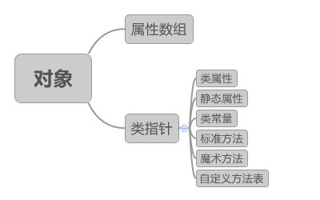

# 面向对象知识总结

## 面向对象理解
### 概念
面向对象是一种程序设计理念，与程序语言无关。它将对象作为程序的基本单元，将属性和方法封装其中以提高软件的重用性、灵活性和扩展性。

### 类与对象
 **关系**：类是对象的抽象组织，对象是类的具体化存在；
 **内部存储**：类是属性和方法的集合，对象是属性的集合。同一个类创建的不同对象，拥有各自不同的属性，但是共享了类代码空间中方法区的代码。
``` php
typedef union _zvalue_value {
    long lval;
    double dval;
    struct {
        char *val;
        int len;
    } str;
    HashTable *ht;
    zend_object_value obj;
} zvalue_value;
```
`_zvalue_value`是PHP源码中对变量的定义，PHP是用C语言开发，union在C中表示结构体，它有如下特点：
```
1. union中可以定义多个成员，union的大小由最大的成员的大小决定；
2. union成员共享同一块大小的内存，一次只能使用其中的一个成员；
3. 对某一个成员赋值，会覆盖其他成员的值。
```
了解C语言中的union特点后即知道zvalue_value一次只能表示一种类型的变量，它可以表示整型、浮点型、字符串、数组（HashTable）和对象（zend_object_value），PHP中还有resource类型，是一个整型值，从而存储在lval中；bool类型用0和1表示，也存储在lval中；NULL类型没有任何意义，不需要用字段表示，因此直接使用C语言中的null表示。
PHP中的对象使用结构体`zend_object_value`存储：
```php
typedef struct _zend_object_value {
    zend_object_handle handle;   //  unsigned int类型，EG(objects_store).object_buckets的索引    
    zend_object_handlers *handlers;
} zend_object_value;
```
PHP内核中将所有对象保存到一个对象列表容器object_buckets中，因此handle字段就是在这个列表容器中的索引；字段handlers的类型是zend_object_handlers，这是一个包含了多个指针函数的结构体，这些指针函数包括对对象属性的操作，对对象方法的操作，克隆等。 此字段会在对象创建的时候初始化。
当我们需要在PHP中存储对象的时候， PHP内核会根据handle索引从对象列表object_buckets中获取相对应的对象。而获取的对象有其独立的结构：
```php
typedef struct _zend_object {
    zend_class_entry *ce;
    HashTable *properties;
    HashTable *guards; /* protects from __get/__set ... recursion */
} zend_object;
```
ce是存储该对象的类结构，在对象初始化时保存了类的入口；properties是一个HashTable，用来存放对象的属性；guards用来阻止递归调用。


### 魔术方法
PHP中以两个下划线'__'开头、具有特殊作用的一些方法叫魔术方法。
 **__get和__set**：
作用：访问和设置类中的私有属性。
示例：
```php
class People {
	private $name;
	//private static $sex;
	//const AGE = 19;
	
	public function say() {
		//echo "I am ".$this->name.", my age is ".self::AGE;
		echo "I am $this->name";
	}
}

$man = new People();
$man->name = 1;
//echo "Jim age is ".$jim::AGE."\n";
$man->say();
```
在没有定义__set方法时直接在类外部访问类私有属性，会产生错误：`PHP Fatal error:  Cannot access private property People::$name`，一般只能通过在类中定义一个public方法，然后在类外调用这个公开的方法实现对私有属性读写。现在可以通过__set和__get方法实现在类外部对私有属性的读写操作。
```php
class People {
	private $name;	
	
	public function __get($name) {
		if(!isset($this->name)) {			
			$this->name = 'yuri';
		}
		return $this->name;
	}
	public function __set($name, $value) {		
		$this->$name = $value;
	}
	public function say() {		
		echo "I am ".$this->name;
	}
}

$man = new People();
echo $man->name."\n";
$man->name = 'xyw';
$man->say();
```
注：类中定义的方法默认修饰符为public，即`public function __get($name)`等价于`function __get($name)`
 **__call和__callStatic**：
作用：防止调用不存在的方法而出错。
__call：防止调用的普通方法不存在而出错；
__callStatic：防止调用的静态方法不存在而出错。
举例：
```php
class People {	
	const AGE = 19;
	const SEX = 'man';
		
	//非静态方法say
	public function say() {		
		echo "I am ".self::AGE." years old \n";			//静态方法调用类常量
	}
	
	//静态方法sex
	public static function sex() {
		echo "I am ".self::SEX."\n";	//静态方法调用类常量
	}	
	
	public function __call($name, $arguments) {
		switch(count($arguments)) {
			case 2:
				echo $arguments[0] * $arguments[1]."\n";
				break;
			case 3:
				echo array_sum($arguments)."\n";
				break;
			default:
				echo "arguments error ！ function name = $name\n";
				break;
		}
	}
	
	public static function __callStatic($name, $arguments) {
		switch(count($arguments)) {
			case 2:
				echo $arguments[0] * $arguments[1]."\n";
				break;
			case 3:
				echo array_sum($arguments)."\n";
				break;
			default:
				echo "arguments error ！ function name = $name\n";
				break;
		}
	}
}

$man = new People();
$man->say();
$man->tell(1, 2);
$man->tell(1, 2, 4);
$man->tell(1, 2, 4, 9);

$man::sex();
$man::walk(1, 2);
$man::walk(1, 2, 4);
$man::walk(1, 2, 4, 9);
```
输出结果：
```
I am 19 years old
2
7
arguments error ！ function name = tell
I am man
2
7
arguments error ！ function name = walk
请按任意键继续. . .

```

 **__toString**：
作用：输出对象字符串信息。
直接echo一个对象会产生语法错误：`PHP Catchable fatal error:  Object of class People could not be converted to string`，而如果在类中实现了__toString()方法后就可以输出对象，且输出的内容在__toString函数中定制。
```php
class People {	
	private $name = 'yuri';
	private $age = '20';
	
	public function __toString() {
		return "Name = $this->name, age = $this->age \n";
	}
}
$man = new People();
echo $man;
```
输出结果：
```
Name = yuri, age = 20
请按任意键继续. . .
```
 **__invoke**：
作用：以调用函数的方式调用一个对象时，__invoke方法会被自动调用。
```php
class People {	
	private $name = 'yuri';
	private $age = '20';
	
	public function __toString() {
		return "Name = $this->name, age = $this->age \n";
	}
	
	public function __invoke(){
		echo $this->name."\n";
	}
}
$man = new People();
$man();		//触发__invoke方法
```

### 静态属性和静态方法

<table class="table table-bordered table-striped table-condensed">
   <tr>      
     <th colspan="5" bgcolor="F5F5F5" style="font-size:15px; padding:5px">静态属性和静态方法</th>     
   </tr>
   <tr>
      <td width="20%" style="text-align:center; font-weight:bold">调用对象</td>
      <td width="20%" style="text-align:center; font-weight:bold">静态属性</td>
      <td width="20%" style="text-align:center; font-weight:bold">非静态属性</td>
      <td width="20%" style="text-align:center; font-weight:bold">静态方法</td>
	  <td width="20%" style="text-align:center; font-weight:bold">非静态方法</td>
   </tr>
   <tr>
      <td rowspan="1" style="text-align:center">对象</td>
      <td width="20%" style="text-align:center">self::</td>
      <td width="20%" style="text-align:center">$this-></td>
      <td width="20%" style="text-align:center">self::或者$this-></td>
	  <td width="20%" style="text-align:center">$this-></td>
   </tr>
   <tr>
      <td rowspan="1" style="text-align:center">类</td>
      <td width="20%" style="text-align:center">self::</td>
      <td width="20%" style="text-align:center">—</td>
      <td width="20%" style="text-align:center">self::</td>
	  <td width="20%" style="text-align:center">—</td>
   </tr>
   <tr>
      <td rowspan="1" style="text-align:center">静态方法</td>
      <td width="20%" style="text-align:center">self::</td>
      <td width="20%" style="text-align:center">—</td>
      <td width="20%" style="text-align:center">self::</td>
	  <td width="20%" style="text-align:center">—</td>
   </tr>
   <tr>
      <td rowspan="1" style="text-align:center">非静态方法</td>
      <td width="20%" style="text-align:center">self::</td>
      <td width="20%" style="text-align:center">$this-></td>
      <td width="20%" style="text-align:center">self::或者$this-></td>
	  <td width="20%" style="text-align:center">$this-></td>
   </tr>   
</table>

```php
class People {	
	static public $sex = 'woman';		//静态属性
	public $name = 'yuri';				//非静态属性
		
	//非静态方法say
	public function say() {		
		echo "I am ".$this->name."\n";			//普通方法调用非静态属性
	}
	
	//静态方法sex
	public static function sex() {
		echo "My gender is ".self::$sex."\n";	//静态方法调用静态属性(注意：不要写成self::sex)
	}
	
	//非静态方法info
	public function info() {
		echo "I am ".$this->name."\n";			//普通方法调用非静态属性
		echo "My gender is ".self::$sex."\n";	//普通方法调用静态属性(注意：不要写成self::sex)
		$this->say();							//普通方法调用普通方法
		self::sex();							//普通方法调用静态方法
		$this->sex();							//普通方法调用静态方法
		
	}
	
	//静态方法walk
	public static function walk() {
		self::sex();							//静态方法调用静态方法
		echo "I can walk \n";
	}
}

echo People::$sex."\n";		//类调用静态属性(注意：不要写成People::sex)
People::sex();				//类调用静态方法
People::walk();				//类调用静态方法


$man = new People();
echo $man::$sex."\n";		//对象调用静态属性(注意：不要写成$man::sex)
echo $man->name."\n";		//对象调用非静态属性

$man::sex();				//对象调用静态方法
$man->sex();				//对象调用静态方法
$man::walk();				//对象调用静态方法

$man->say();				//对象调用非静态方法
$man->info();				//对象调用非静态方法
```
输出结果：
```
woman
My gender is woman
My gender is woman
I can walk
woman
yuri
My gender is woman
My gender is woman
My gender is woman
I can walk
I am yuri
I am yuri
My gender is woman
I am yuri
My gender is woman
My gender is woman
请按任意键继续. . .
```
总结：类和静态方法只能通过self::调用静态属性和静态方法；
对象和非静态方法可以调用类的静态属性和静态方法，以及非静态属性和普通方法。

### 类常量
 类常量是个定值，始终保持不变，不能用public，protected，private，static修饰；
 类、对象(PHP 5.3.0后)、静态方法、非静态方法均可以调用类常量，调用方式为self::
 PHP5.3.0起，可以用一个变量来动态调用类。但该变量的值不能为关键字（如self，parent或static）
```php
class People {	
	const AGE = 19;
	const SEX = 'man';
		
	//非静态方法say
	public function say() {		
		echo "I am ".self::AGE." years old \n";			//静态方法调用类常量
	}
	
	//静态方法sex
	public static function sex() {
		echo "I am ".self::SEX."\n";	//静态方法调用类常量
	}	
}

echo People::AGE."\n";		//类调用类常量
People::sex();				//类调用静态方法


$man = new People();
echo $man::AGE."\n";		//对象调用类常量（PHP 5.3.0后）

$man->say();				//对象调用非静态方法
$man::sex();				//对象调用静态方法

$object = 'People';			//PHP 5.3.0后
echo $object::AGE."\n";
```
输出结果：
```
19
I am man
19
I am 19 years old
I am man
19
请按任意键继续. . .
```

### 反射
在PHP运行状态中动态提取出关于类、方法、属性、参数等详细信息。
```php
class People {	
	private $name = 'yuri';
	private $age = '20';
	public static $sex = 'woman';		//静态属性
	
	public function __toString() {
		return "Name = $this->name, age = $this->age \n";
	}
	
	public function __invoke(){
		echo $this->name."\n";
	}
	
	//非静态方法say
	public function say() {		
		echo "I am ".$this->name."\n";			
	}
	
	//静态方法sex
	public static function sex() {
		echo "My gender is ".self::$sex."\n";	
	}
	
	
}
$man = new People();
$reflect = new ReflectionObject($man);
$props = $reflect->getProperties();			//获取类属性
print_r($props);
```
print_r($props);输出的是一个ReflectionProperty的对象数组，可以使用getName方法输出ReflectionProperty对象的属性名称。
```
Array
(
    [0] => ReflectionProperty Object
        (
            [name] => name
            [class] => People
        )

    [1] => ReflectionProperty Object
        (
            [name] => age
            [class] => People
        )

    [2] => ReflectionProperty Object
        (
            [name] => sex
            [class] => People
        )

)
请按任意键继续. . .
```
```php
class People {	
	private $name = 'yuri';
	private $age = '20';
	public static $sex = 'woman';		//静态属性
	
	public function __toString() {
		return "Name = $this->name, age = $this->age \n";
	}
	
	public function __invoke(){
		echo $this->name."\n";
	}
	
	//非静态方法say
	public function say() {		
		echo "I am ".$this->name."\n";			
	}
	
	//静态方法sex
	public static function sex() {
		echo "My gender is ".self::$sex."\n";	
	}
	
	
}
$man = new People();
$reflect = new ReflectionObject($man);
$props = $reflect->getProperties();			//获取类属性
//print_r($props);
echo "---properties list---\n";
if(!empty($props)) {
	foreach($props as $v) {
		echo $v->getName()."\n";			//打印属性名称列表
	}
}
$methods = $reflect->getMethods();
//print_r($methods);
echo "----methods  list----\n";
if(!empty($methods)) {
	foreach($methods as $v) {
		echo $v->getName()."\n";			//打印方法名称列表
	}
}
/*
//举一反三，可以查看ReflectionObject反射类的属性和方法列表
$ref = new ReflectionObject($reflect);
$ref_meth = $ref->getMethods();
print_r($ref_meth);
*/
```
输出结果：
```
---properties list---
name
age
sex
----methods  list----
__toString
__invoke
say
sex
请按任意键继续. . .
```

### 异常与错误
 使用场景：
- 对程序的悲观预测，认为自己的代码无法处理各种可预见、不可预见的情况。
- 保护业务数据的一致性。
异常处理机制可以把每件事当做事务处理。用try包裹可能出现异常的代码段，然后用catch捕捉异常，并进行一定的补救措施，保证业务数据的一致性。

 作用：
使用try...catch处理的好处就是：可以把异常造成的逻辑中断破坏降低到最小范围内，并且经过补救后不会影响业务逻辑的完整性；乱抛异常和只抛不捕获，或捕获而不补救，会导致数据混乱。

 错误级别：
deprecated、notice、warning、fetal error、parse error，错误级别由低到高。

技巧：在正式环境部署代码时使用`error_reporting(0); `可以关闭错误提示，防止泄露敏感信息。

### 参考资料
[1] [PHP变量在内存中的表示](http://gywbd.github.io/posts/2015/4/php-variable-in-memory.html)
[2] [PHP内核探索：对象](http://www.nowamagic.net/librarys/veda/detail/1521)
[3] [php面向对象中static静态属性和静态方法的调用](http://www.jb51.net/article/60871.htm)
[4] [php中静态属性静态方法的用法](http://blog.sina.com.cn/s/blog_6f49a3c30100p43t.html)